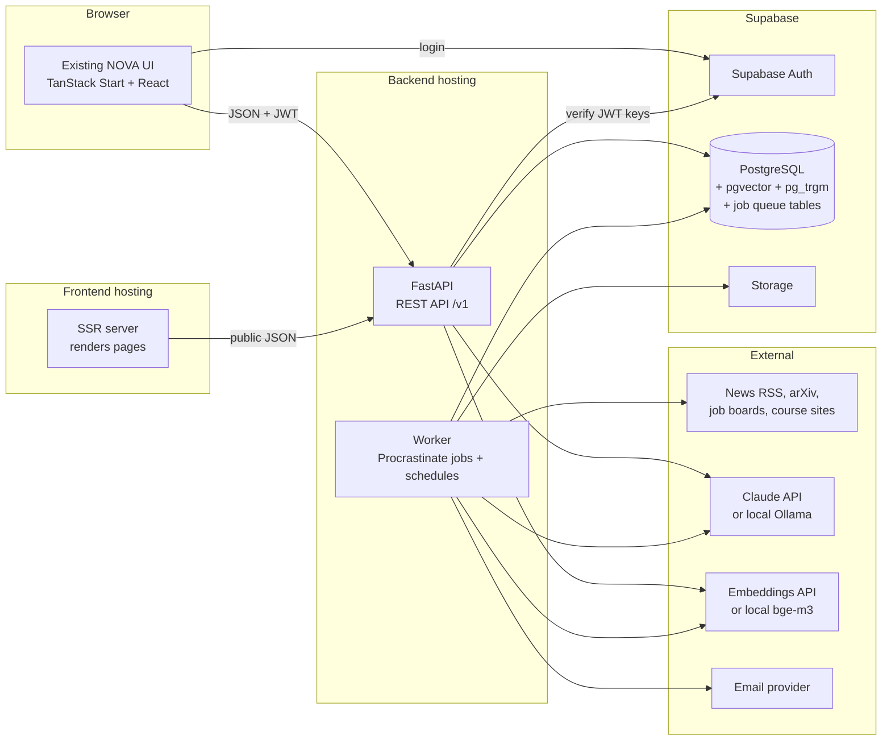
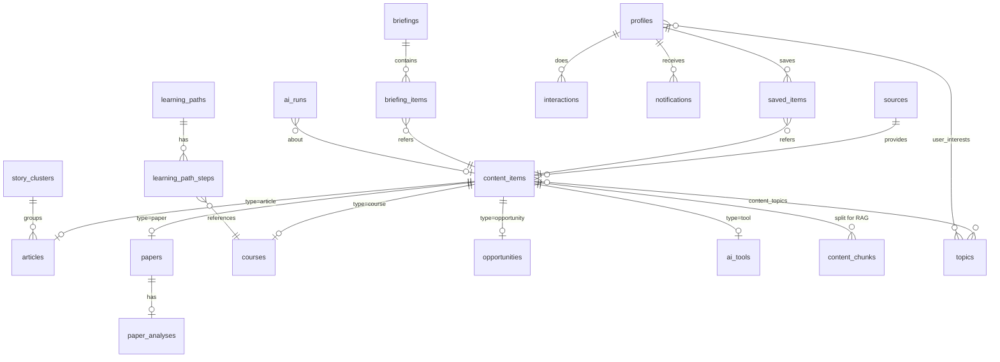
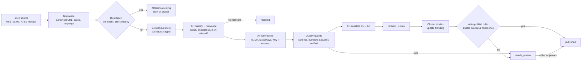
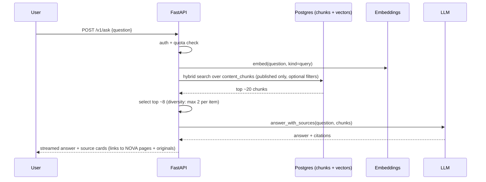
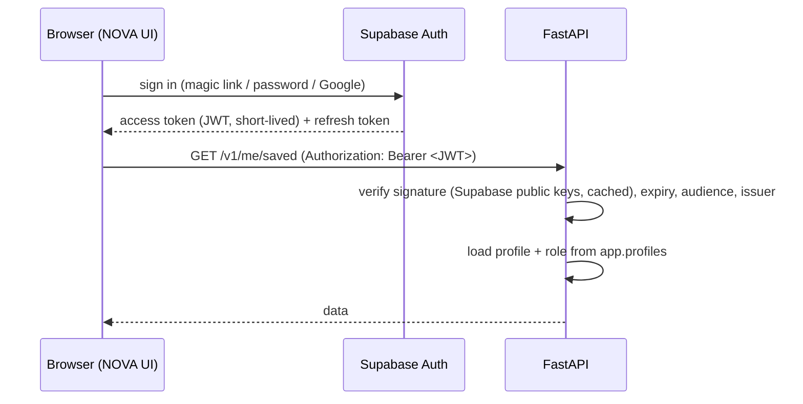

# NOVA AI — Target Architecture

> **Status:** Design only. Nothing in this document has been implemented yet.
> **Inputs:** `PROJECT_ANALYSIS.md` and the current codebase (commit `5da6499` + analysis).
> **Companion document:** `IMPLEMENTATION_PLAN.md` (the step-by-step build order).

---

## Table of Contents

1. [Goals and Design Principles](#1-goals-and-design-principles)
2. [Evaluation of the Proposed Stack](#2-evaluation-of-the-proposed-stack)
3. [Final Technology Choices](#3-final-technology-choices)
4. [System Overview](#4-system-overview)
5. [Repository Structure](#5-repository-structure)
6. [Data Model](#6-data-model)
7. [Content Pipeline (Ingest → Publish)](#7-content-pipeline-ingest--publish)
8. [AI Layer](#8-ai-layer)
9. [Search, Semantic Search and Related Content](#9-search-semantic-search-and-related-content)
10. [RAG (Ask NOVA)](#10-rag-ask-nova)
11. [Daily AI Briefing](#11-daily-ai-briefing)
12. [Personalization, Recommendations and Notifications](#12-personalization-recommendations-and-notifications)
13. [Authentication and Authorization](#13-authentication-and-authorization)
14. [API Design](#14-api-design)
15. [Background Jobs and Schedules](#15-background-jobs-and-schedules)
16. [Frontend Integration (Preserving the UI)](#16-frontend-integration-preserving-the-ui)
17. [Security Architecture](#17-security-architecture)
18. [Environments and Deployment](#18-environments-and-deployment)
19. [Observability](#19-observability)
20. [Scalability Path](#20-scalability-path)
21. [Cost Model](#21-cost-model)
22. [Feature → Component Map](#22-feature--component-map)
23. [Decisions Needed From the Owner](#23-decisions-needed-from-the-owner)
24. [Glossary (Plain English)](#24-glossary-plain-english)

---

## 1. Goals and Design Principles

**Goal:** turn the existing Lovable prototype into a serious, bilingual (English/Arabic) AI information platform covering news, research, learning, opportunities, tools, daily briefings, personalization, and AI-powered search/Q&A.

**Principles** (every later decision is checked against these):

| # | Principle | What it means in practice |
| --- | --- | --- |
| P1 | **Preserve the UI** | The frontend keeps its look, pages, and components. We change *where data comes from*, not how it's displayed. New pages reuse the existing design system. |
| P2 | **Boring, proven technology** | Few moving parts. PostgreSQL does storage, search, vectors, *and* the job queue. No extra servers until measurements demand them. |
| P3 | **One source of truth** | All data lives in one PostgreSQL database; all business rules live in one backend (FastAPI). |
| P4 | **Small, reversible steps** | Every phase ships something testable and can be switched off (feature flags, mock-data fallback). |
| P5 | **AI is a replaceable part** | AI providers sit behind an interface. Swapping cloud ↔ local models is a config change, not a rewrite. |
| P6 | **Trust and attribution** | Every AI output is labelled, linked to its sources, validated, and reviewable. We summarise and link; we never republish full articles. |
| P7 | **Secure by default** | Secrets only on the server, deny-by-default database access, validated inputs, least privilege — from Phase 2 onward, not bolted on at the end. |
| P8 | **Observable and affordable** | Every job and AI call is logged with its cost; daily spend caps prevent surprise bills. |

---

## 2. Evaluation of the Proposed Stack

| Layer | Proposed | Verdict | Reasoning |
| --- | --- | --- | --- |
| Frontend | Existing Lovable frontend | ✅ **Keep** | TanStack Start + React 19 is modern, SSR-capable (good for SEO), and the UI is the most valuable asset. It becomes a pure *client* of the API. |
| Backend | Python + FastAPI | ✅ **Keep** | Python has the best ecosystem for this product: feed parsing, article text extraction, PDF parsing, embeddings, local-model runtimes, scientific APIs. FastAPI gives automatic request validation (Pydantic) and auto-generated API docs/OpenAPI, which we'll use to generate TypeScript types for the frontend. |
| Database | PostgreSQL / Supabase | ✅ **Keep, with one refinement** | Use a **Supabase project that you own directly** (not the Lovable-managed "Lovable Cloud" database). See §2.1. |
| AI | Provider abstraction (cloud + local) | ✅ **Keep, built in-house and thin** | A small interface of our own rather than a large framework. See §2.2. |
| Search | Postgres Full-Text Search + pgvector | ✅ **Keep, plus `pg_trgm`** | Covers keyword, fuzzy (typos), and semantic search inside the same database. Combined via *hybrid ranking*. No Elasticsearch/vector DB needed at this scale. |
| Automation | Scheduled background jobs | ✅ **Keep — using a Postgres-backed queue** | Use **Procrastinate** (a Python task queue that stores jobs in PostgreSQL) instead of Celery + Redis. See §2.3. |
| Auth | Secure auth compatible with backend/DB | ✅ **Supabase Auth** | Battle-tested login (email, magic link, Google), issues signed tokens (JWTs) that FastAPI verifies. We never store passwords ourselves. See §2.4. |

### 2.1 Why your own Supabase project instead of Lovable Cloud

Lovable Cloud is Supabase managed *through* Lovable, and it's designed so that Lovable's AI controls the database schema. Our architecture needs:
- a **direct PostgreSQL connection string** for FastAPI and the job worker;
- **our own migration tool** (Alembic) to be the single owner of the schema;
- control over backups, extensions (`pgvector`, `pg_trgm`), and database roles.

A Supabase project created in your own Supabase account gives all of this, and can still be linked to Lovable later if you want. **Rule:** once the backend owns the schema, Lovable should not be asked to create or change tables. (Exact Lovable Cloud capabilities should be re-checked at Phase 3; if it exposes all of the above, it becomes an acceptable alternative.)

### 2.2 Why a thin, in-house AI abstraction (not LangChain / LlamaIndex / LiteLLM)

- We need only a handful of operations: *generate structured output*, *generate text with citations*, *embed text*. A ~200-line interface covers them.
- Large frameworks add many dependencies, change APIs frequently, and hide what is actually sent to the model — harder for a beginner to debug and a larger supply-chain surface.
- Each adapter uses the **official SDK/API of its provider** (e.g. the official `anthropic` Python SDK for Claude), so we get provider-specific features (structured outputs, citations, prompt caching, batch discounts) instead of a lowest-common-denominator.

### 2.3 Why Procrastinate (Postgres queue) instead of Celery + Redis

| | Procrastinate | Celery + Redis | APScheduler (in-process) |
| --- | --- | --- | --- |
| Extra infrastructure | **None** (uses our Postgres) | Redis server | None |
| Durable jobs (survive restarts) | ✅ | ✅ | ❌ |
| Retries, locks, periodic (cron) tasks | ✅ | ✅ | Partial |
| Jobs visible with plain SQL | ✅ | ❌ | ❌ |
| Beginner-friendliness | High | Medium | High but fragile |

Our job volume (thousands per day, not millions per minute) fits comfortably in Postgres. If we ever outgrow it, tasks are plain Python functions and can be moved to another queue.

### 2.4 Why Supabase Auth instead of building auth in FastAPI

- Password hashing, email verification, password reset, OAuth (Google), token refresh, and brute-force protection are all solved and maintained.
- The frontend already runs in the browser/SSR and Supabase ships a JS client for it.
- FastAPI only needs to **verify** the token signature (using Supabase's published keys) — a small, well-understood piece of code.

---

## 3. Final Technology Choices

| Concern | Choice | Notes |
| --- | --- | --- |
| Frontend | Existing TanStack Start + React 19 + Tailwind + shadcn/ui | Unchanged design system |
| Frontend data fetching | TanStack Query (already installed) + route loaders | SSR for public pages |
| Frontend API types | Generated from FastAPI's OpenAPI schema (`openapi-typescript`) | Frontend and backend can't drift apart silently |
| Backend language/runtime | Python 3.12+ | |
| Backend framework | FastAPI + Uvicorn | |
| Python packaging | `uv` (with lockfile) | Fast, reproducible installs |
| Validation / settings | Pydantic v2, `pydantic-settings` | |
| Database access | SQLAlchemy 2.0 (async) + `asyncpg` | |
| Migrations | Alembic | Single owner of the app schema |
| Database | Supabase PostgreSQL + `pgvector` + `pg_trgm` | Two projects: `nova-dev`, `nova-prod` |
| Job queue & scheduler | Procrastinate (Postgres-backed) | Separate *worker* process |
| HTTP client (fetchers) | `httpx` | Timeouts, size limits, SSRF guard |
| RSS/Atom parsing | `feedparser` | Also parses the arXiv API (Atom) |
| Article text extraction | `trafilatura` | Main-text extraction from HTML |
| PDF text extraction | `pypdf` (permissive license) | GROBID optional later for rich structure |
| LLM (cloud, default) | Anthropic Claude via official `anthropic` Python SDK | See §8 |
| LLM (local, optional) | Ollama (runs open-weight models on your own machine/GPU server) | Same interface |
| Embeddings (cloud, default) | Voyage AI multilingual embedding model (1024-dim) | Anthropic does not offer an embeddings model |
| Embeddings (local, optional) | `BAAI/bge-m3` (multilingual incl. Arabic, 1024-dim) via `sentence-transformers` | Same dimension → no schema change |
| Auth | Supabase Auth (email magic link/password + Google) | JWT verified in FastAPI |
| Email | Resend (transactional + digest), behind an interface | Postmark is an equal alternative |
| File storage (if needed) | Supabase Storage | e.g. cached images, PDFs |
| Frontend hosting | Lovable hosting (as today) → optional Cloudflare later | |
| Backend hosting | Render: 1 web service (API) + 1 background worker, same Docker image | Railway / Fly.io are equivalent alternatives |
| Error monitoring | Sentry (frontend, API, worker) | |
| Lint/format/test (Python) | Ruff, mypy, pytest | |
| Lint/test (frontend) | ESLint/Prettier (existing), Vitest, Playwright | Playwright also used for visual-regression screenshots |
| CI | GitHub Actions | |

---

## 4. System Overview



**Three running programs** (plus managed services):

1. **Frontend** — the existing app. Renders pages; talks to Supabase *only for login*; gets all data from the API.
2. **API** (FastAPI) — answers requests from the frontend: lists, details, search, Q&A, saved items, preferences, admin actions. Stateless → can run several copies.
3. **Worker** — does slow work in the background: fetching sources, AI processing, embeddings, daily brief, notifications, emails. Runs on a schedule and from a queue.

**Key rule:** the browser never talks to the database directly for data. It only talks to the API. This keeps all rules in one place (P3).

---

## 5. Repository Structure

The frontend **stays exactly where it is** (Lovable expects it at the repository root). The backend is added in a new `backend/` folder.

```
nova-platformai/
├── src/                          # existing frontend (unchanged location)
│   ├── routes/                   # existing pages + new pages later
│   ├── components/               # existing components (preserved)
│   ├── data/                     # mock data → kept as fallback + test fixtures
│   └── lib/
│       ├── api/                  # NEW: API client, generated types, adapters
│       └── auth/                 # NEW: Supabase auth helpers
├── backend/                      # NEW
│   ├── pyproject.toml / uv.lock
│   ├── Dockerfile
│   ├── alembic/                  # database migrations
│   ├── app/
│   │   ├── main.py               # FastAPI app factory
│   │   ├── config.py             # settings from environment variables
│   │   ├── core/                 # config, database, logging, errors, middleware, security (JWT), rate limits
│   │   ├── models/               # SQLAlchemy tables
│   │   ├── schemas/              # Pydantic request/response shapes (the API contract)
│   │   ├── api/v1/               # route modules: news, research, courses, opportunities,
│   │   │                         #   tools, briefings, search, ask, me, admin, health
│   │   ├── services/             # business logic (feeds, scoring, recommendations…)
│   │   ├── repositories/         # data access layer: all database queries
│   │   ├── ingestion/            # source connectors: rss.py, arxiv.py, greenhouse.py, …
│   │   ├── ai/
│   │   │   ├── providers/        # base.py, anthropic_provider.py, ollama_provider.py, fake.py
│   │   │   ├── embeddings/       # base.py, voyage.py, local_bge.py, fake.py
│   │   │   ├── tasks/            # summarize.py, translate.py, classify.py, analyze_paper.py, …
│   │   │   └── prompts/          # versioned prompt files (*.md)
│   │   ├── search/               # full-text, vector, hybrid ranking
│   │   ├── rag/                  # chunking, retrieval, answer generation
│   │   ├── jobs/                 # Procrastinate app, task definitions, schedules
│   │   └── cli.py                # manual commands: ingest, process, seed, brief…
│   └── tests/                    # unit, integration, API tests + fixtures
├── .github/workflows/            # NEW: CI for frontend and backend
├── PROJECT_ANALYSIS.md
├── ARCHITECTURE.md
└── IMPLEMENTATION_PLAN.md
```

Why a single repository ("monorepo"): one place to review changes, frontend and backend contract changes land together, and Lovable keeps working because the frontend layout is untouched.

---

## 6. Data Model

> **Implemented in Phase 3.** [`DATABASE.md`](DATABASE.md) is the authoritative, table-by-table description; this section is the original design sketch. Main differences: topics are `categories` + `tags`; AI run records are `processing_logs`; job records are `collection_jobs`; errors are `error_logs`; RAG chunks live in `embeddings`.

### 6.1 Core idea: one "content item" table + type-specific detail tables

Every piece of content — article, paper, course, opportunity, tool, briefing — gets **one row in `content_items`** with the common fields (title, summary, URL, dates, language, status, search vectors, embedding). Type-specific fields live in a detail table linked 1-to-1.

**Why:** saved items, search, related content, RAG, notifications, and personalization all work across *every* content type with a single implementation.



### 6.2 Tables (key columns only)

All app tables live in a dedicated PostgreSQL schema named **`app`** (not `public`), so Supabase's auto-generated public data API cannot expose them (see §17).

**Content**

| Table | Key columns |
| --- | --- |
| `sources` | id, name, kind (`rss` \| `arxiv` \| `ats_greenhouse` \| `ats_lever` \| `manual` \| …), url, language, trust_level (1–5), enabled, fetch_interval_min, etag, last_modified, last_fetched_at, consecutive_errors |
| `topics` | id, slug, name_en, name_ar, parent_id (e.g. *AI Research → Computer Vision*) |
| `content_items` | id (UUID), type (`article` \| `paper` \| `course` \| `opportunity` \| `tool`), slug, source_id, canonical_url, url_hash (unique), original_language, **title_en, title_ar, summary_en, summary_ar**, image_url, published_at, updated_at, status (`ingested` → `enriched` → `published` \| `needs_review` \| `rejected` \| `archived`), importance (1–5), trending_score, ai_generated (bool), translation_status, `search_en` (tsvector), `search_ar` (tsvector), `embedding` (vector(1024)), embedding_model |
| `content_topics` | content_id, topic_id, confidence |
| `articles` | content_id, author, cluster_id, body_text (extracted, internal use only), tldr_en/ar, takeaways_en/ar (JSON), why_it_matters_en/ar, what_happened_en/ar (JSON), metrics (JSON), quote_en/ar, timeline (JSON), views, reading_minutes |
| `story_clusters` | id, title_en/ar, first_seen_at, last_seen_at, source_count (drives *Trending*) |
| `papers` | content_id, arxiv_id, doi, authors (JSON), abstract, categories, pdf_url, full_text (internal), citation_count, code_url |
| `paper_analyses` | content_id, problem, method, key_results, limitations, why_it_matters, beginner_explanation, key_terms (JSON), difficulty — each `_en`/`_ar` |
| `courses` | content_id, provider, level, duration_text, duration_hours, language_of_instruction, is_free, certificate, url |
| `learning_paths` / `learning_path_steps` | path title_en/ar, level; step order, title_en/ar, optional course_id |
| `opportunities` | content_id, **opportunity_type** (`scholarship` \| `fellowship` \| `internship` \| `job` \| `competition` \| `hackathon` \| `bootcamp` \| `research`), organization, location_en/ar, is_remote, country, eligibility_en/ar, deadline_at (real timestamp), starts_at, apply_url, compensation, seniority (jobs), employment_type (jobs) |
| `ai_tools` | content_id, website, pricing (`free` \| `freemium` \| `paid` \| `open_source`), platforms, use_cases (JSON) |
| `content_chunks` | id, content_id, chunk_index, language, text, token_count, embedding vector(1024) — used by RAG |
| `briefings` / `briefing_items` | date, status, headline_en/ar, intro_en/ar, signal_of_the_day_en/ar; items: position, content_id, blurb_en/ar |

> **Why columns `*_en` / `*_ar` instead of one JSON object?** PostgreSQL full-text search needs one searchable column per language, and plain columns are easier to query and index. The **API still returns `{ en, ar }` objects**, exactly the `Localized` shape the frontend already uses, so the UI does not change.

**Users**

| Table | Key columns |
| --- | --- |
| `profiles` | user_id (= Supabase `auth.users.id`), display_name, role (`user` \| `editor` \| `admin`), language, theme, timezone, onboarding_done |
| `user_interests` | user_id, topic_id, weight (explicit from onboarding + learned) |
| `user_preferences` | user_id, email_digest (`off` \| `daily` \| `weekly`), notify_deadlines, notify_topics, quiet_hours |
| `saved_items` | user_id, content_id, created_at (unique pair) |
| `interactions` | user_id, content_id, kind (`view` \| `click_out` \| `save` \| `dismiss` \| `search_click`), created_at — powers personalization & trending |
| `notifications` | id, user_id, kind (`deadline` \| `topic_match` \| `briefing` \| `system`), content_id, title_en/ar, body_en/ar, read_at, created_at |
| `newsletter_subscribers` | email, language, confirmed_at, unsubscribe_token (works without an account) |
| `ask_sessions` / `ask_messages` | RAG conversations (logged-in users only, with retention limit) |

**Operations**

| Table | Purpose |
| --- | --- |
| `ai_runs` | Every AI call: task, provider, model, prompt_version, input/output tokens, cost_usd, latency_ms, status, content_id. Used for cost dashboards, debugging, and daily spend caps. |
| `job_runs` | Summary of scheduled job executions (started, finished, items processed, errors). Procrastinate also keeps its own job tables. |
| `fetch_log` | Per-source fetch results (HTTP status, items found/new, error). |
| `audit_log` | Admin/editor actions (publish, reject, edit). |

### 6.3 Mapping current mock data → new schema

The current `NewsItem`, `Course`, `Opportunity` TypeScript types map almost field-for-field. Pre-formatted strings become real values:

| Current (mock) | New (database) | Displayed as (frontend computes) |
| --- | --- | --- |
| `published: {en:"Sep 21, 2026", ar:"21 سبتمبر 2026"}` | `published_at` timestamp | formatted with `date-fns` + Arabic locale |
| `updated: "Updated 28 min ago"` | `updated_at` timestamp | relative time ("28 min ago") |
| `readTime: "6 min read"` | `reading_minutes` int | "6 min read" / "6 دقائق للقراءة" |
| `views: "12.8K"`, `comments: "184"` | `views` int (comments dropped until a comment system exists) | compact number formatting |
| `category: {en, ar}` | primary topic via `content_topics` | same |
| `deadline: {en:"Oct 4, 2026"}`, `status:"soon"` | `deadline_at` timestamp | status computed: *closing soon* if < 14 days |

The current mock content becomes the **seed data** for the development database, so the site looks identical the first time it's connected.

---

## 7. Content Pipeline (Ingest → Publish)



- **Each arrow is a separate, retryable job.** A failure in translation doesn't lose the fetch; the item simply waits in its current status.
- **Idempotent:** running any step twice produces the same result (safe retries).
- **Status field** on `content_items` is the single source of truth for where an item is.
- **Relevance filter first:** cheap rules (keyword lists, source trust, embedding similarity to "AI topics") run *before* expensive AI summarisation to control cost.
- **Legal/attribution:** full extracted text is stored only for internal processing (summaries, embeddings, RAG retrieval) and is never shown in full to users; pages show our summary + a prominent link to the original (already how the Article page is designed). Raw text is purged after a retention period (e.g. 90 days) except for openly licensed content.
- **Images:** use the source's declared preview image URL when permitted, otherwise fall back to the existing category images in `src/assets/`.

### Sources (initial candidates — to be confirmed with the owner)

| Area | Candidates | Method |
| --- | --- | --- |
| AI news | AI lab blogs (Anthropic, OpenAI, Google DeepMind, Meta AI, Hugging Face), MIT Technology Review AI, The Verge AI, TechCrunch AI, VentureBeat AI, Arabic-language tech outlets | RSS/Atom |
| Research | arXiv (`cs.AI`, `cs.LG`, `cs.CL`, `cs.CV`, `cs.RO`, `stat.ML`); enrichment from Semantic Scholar / OpenAlex (citations) | arXiv API (≤ 1 request / 3 s), REST APIs |
| Jobs | Public job boards of a curated list of AI companies (Greenhouse, Lever, Ashby public JSON endpoints) | ATS connectors |
| Scholarships, fellowships, competitions, internships | Curated manually + AI-assisted extraction from a submitted URL | Admin/editor entry |
| Courses & learning paths | Curated (DeepLearning.AI, Coursera, edX, fast.ai, Google, Microsoft Learn, Kaggle Learn…) | Admin/editor entry, provider feeds where available |
| AI tools | Curated directory | Admin/editor entry |

Every source's terms of use and `robots.txt` are checked before it is enabled.

---

## 8. AI Layer

### 8.1 Interfaces (the "provider abstraction")

Design sketch (illustrative, not final code):

```python
class LLMProvider(Protocol):
    name: str
    async def generate_structured(self, task: TaskSpec, input: TaskInput,
                                  schema: type[BaseModel]) -> StructuredResult: ...
    async def answer_with_sources(self, question: str,
                                  sources: list[SourceDoc]) -> CitedAnswer: ...
    async def submit_batch(self, jobs: list[BatchJob]) -> BatchHandle: ...   # optional

class EmbeddingProvider(Protocol):
    name: str
    dimensions: int            # 1024 for all supported providers
    async def embed(self, texts: list[str], kind: Literal["document", "query"]) -> list[list[float]]: ...
```

| Adapter | Implements | Notes |
| --- | --- | --- |
| `AnthropicProvider` | LLM | Official `anthropic` Python SDK. Uses structured outputs, citations, prompt caching, Message Batches. |
| `OllamaProvider` | LLM | Local open-weight models. Structured output via JSON schema + Pydantic validation; citations via numbered-source prompting. |
| `FakeProvider` | LLM + embeddings | Deterministic outputs for tests and CI — **no paid API calls in CI**. |
| `VoyageEmbeddings` | Embeddings | Cloud, multilingual. |
| `LocalBGEEmbeddings` | Embeddings | `bge-m3` via `sentence-transformers`, runs on the worker (CPU is OK at our volume; GPU faster). |

**Configuration per task** (environment variables or a small config table), e.g.:

```
AI_TASK_SUMMARIZE_PROVIDER=anthropic
AI_TASK_SUMMARIZE_MODEL=claude-opus-5-5
AI_TASK_SUMMARIZE_EFFORT=medium
AI_TASK_TRANSLATE_PROVIDER=ollama          # example: run translation locally
AI_TASK_TRANSLATE_MODEL=<local model name>
EMBEDDINGS_PROVIDER=voyage
AI_DAILY_BUDGET_USD=10
```

Switching any task between cloud and local = changing config, no code change.

### 8.2 AI tasks

| Task | Input | Output (validated schema) | Suggested effort* |
| --- | --- | --- | --- |
| `classify` | title + first ~1,500 words | is_ai_related, topics[], importance 1–5, content kind, confidence | low |
| `summarize_article` | extracted article text | title, summary, TL;DR, 3–5 takeaways, why it matters, what happened (paragraphs), metrics[] (value+label), quote (verbatim), timeline[] | medium |
| `translate` | structured English fields | same structure in Arabic (glossary of AI terms enforced) | low |
| `extract_opportunity` | text of an opportunity page | type, organization, deadline (ISO date), eligibility, location, remote, apply URL, compensation | low |
| `analyze_paper` | abstract + extracted PDF text | problem, method, key results, limitations, why it matters, beginner explanation, key terms, difficulty | high |
| `cluster_title` | titles of articles in a cluster | neutral headline for the story | low |
| `daily_brief` | top ~10 selected items (already summarised) | headline, intro, 5–7 items with blurbs, "one essential signal" | high |
| `search_understanding` | user query | cleaned query, detected filters (type, date range, topic), language | low |
| `rag_answer` | question + retrieved chunks | answer text + citations to sources | medium |
| `learning_advice` (later) | user goals + candidate courses | ordered recommendation with reasons | medium |

\* "Effort" controls how much the model reasons before answering; lower = faster and cheaper. Tuned per task by measurement.

Every task has: a **versioned prompt file** (`ai/prompts/summarize_article.v1.md`), a **Pydantic output schema**, a **FakeProvider fixture**, and a small **evaluation set** (see Implementation Plan, Phase 7).

### 8.3 Claude-specific design notes (cloud default)

These reflect the current Claude API and must be respected when implementing the `AnthropicProvider`:

- **SDK:** official `anthropic` Python SDK only.
- **Default model:** `claude-opus-5-5` for all tasks, with the **`effort` setting chosen per task** (table above). On this model reasoning ("thinking") is always on and cannot be disabled; `effort` is the control, and its default is `medium`, so we always set it explicitly. Model and effort are per-task config, so the owner can later choose a different Claude model (e.g. a Sonnet or Haiku model) for high-volume tasks after comparing quality and cost — that's a product decision, see §23.
- **Structured outputs:** use the SDK's structured-output support (`output_config.format` / `messages.parse()` with Pydantic models) so responses are guaranteed to match our schemas. Do not rely on "assistant prefill" (not supported) or forced tool choice (not supported on this model) for JSON.
- **Citations for RAG:** pass retrieved chunks as `document` content blocks with citations enabled; the API returns which exact text each sentence cites. (Citations can't be combined with structured outputs in the same call, so `rag_answer` uses citations and plain text; all other tasks use structured outputs.)
- **Prompt caching:** put the stable part first (system prompt, instructions, glossary, examples) and the variable article text last; never put timestamps or IDs in the system prompt. Verify with `usage.cache_read_input_tokens` in `ai_runs`. Very short prompts won't cache (minimum prefix size applies).
- **Message Batches API:** ~50% cheaper, results within hours → used for non-urgent bulk work (nightly paper analysis, re-translation, backfills). Results can arrive in any order; match by `custom_id`.
- **Refusals:** always check `stop_reason` before reading content; `"refusal"` → mark item `needs_review`. On the standard (non-batch) Claude API enable the server-side fallback option (`fallbacks: "default"` with its beta header) so a declined request is automatically retried on a fallback model; not available on the Batches API.
- **Long outputs:** use streaming for large responses (e.g. paper analysis) to avoid HTTP timeouts.
- **Pricing (Sept 2026, per million tokens):** Opus 5.5 $4 input / $20 output (cache reads $0.20); Sonnet 5.5 $2 / $10; Haiku 4.5 $1 / $5. Reasoning tokens bill as output. Always re-check the pricing page before budgeting.

### 8.4 Local models (optional)

- **Runtime:** Ollama on a machine with a GPU (your own PC for development, or a GPU server). The cloud hosting in §18 does **not** include a GPU.
- **Good fits:** translation, classification, embeddings (`bge-m3`) — high volume, lower difficulty.
- **Keep on cloud initially:** summaries of important stories, paper analysis, daily brief, RAG answers — until an evaluation shows the local model meets the quality bar.
- **Same validation:** local output goes through the same Pydantic schemas and quality guards.

### 8.5 Quality and safety guards

| Guard | How |
| --- | --- |
| Schema validity | Pydantic validation; one retry; else `needs_review` |
| Numbers are real | Every number in `metrics` must appear in the source text |
| Quotes are real | `quote` must be a verbatim substring of the source text, else dropped |
| Grounded answers | RAG must cite sources; "I couldn't find this in NOVA's sources" if retrieval is weak |
| Prompt injection | Source text is wrapped as clearly-delimited *data*; ingestion AI calls have **no tools** with side effects; outputs are schema-validated, never executed |
| Labelling | UI keeps the existing "AI-generated summary" label; machine translations marked |
| Human review | Low confidence, low-trust source, refusal, or guard failure → review queue |
| Cost caps | `AI_DAILY_BUDGET_USD`; when reached, non-urgent tasks pause until next day |
| Traceability | Every output row stores `ai_run_id` → prompt version, model, cost |

---

## 9. Search, Semantic Search and Related Content

### 9.1 Three search signals, one ranked list

| Signal | Technology | Good at |
| --- | --- | --- |
| Keyword | PostgreSQL full-text search on `search_en` / `search_ar` (GIN index) | Exact terms, names ("Llama", "NeurIPS") |
| Fuzzy | `pg_trgm` trigram similarity on titles | Typos, partial words |
| Semantic | `pgvector` cosine distance on embeddings (HNSW index) | Meaning ("robots learning by watching" → *imitation learning* papers), cross-language (Arabic query finds English content) |

Results are merged with **Reciprocal Rank Fusion (RRF)** — each item's score is the sum of `1 / (60 + rank)` across the lists — then lightly boosted by recency and importance. This is simple, needs no tuning data, and works well in practice.

Language: the English tsvector uses the `english` configuration; Arabic uses PostgreSQL's `arabic` configuration if present on the Supabase instance (verify in Phase 8), otherwise `simple`. Semantic search covers the gap either way, because the embedding model is multilingual.

### 9.2 "AI-powered search"

1. `search_understanding` (optional, cheap) turns a natural question into a query + filters (e.g. "remote AI internships closing this month" → type=opportunity, opportunity_type=internship, is_remote=true, deadline ≤ 30 days).
2. Hybrid retrieval (above) with those filters.
3. Optional **"AI answer" box** above the results = the RAG flow (§10), shown only when the query is a question.

The existing ⌘K search modal keeps its look; it simply calls `/v1/search` and can show grouped results (News / Research / Opportunities / Courses / Tools).

### 9.3 Related content

- For each item: nearest neighbours by embedding (excluding the same story cluster), filtered to `published`, mixed types allowed (an article about a new model → the paper, a course on the technique, a related job).
- Precomputed nightly into a small `related_items` cache table for speed; recomputed when an item is published.
- Powers the existing "Related Stories" section on the Article page.

### 9.4 Performance targets

| Query | Target (p95) |
| --- | --- |
| List endpoints (home, news, courses…) | < 150 ms |
| Hybrid search | < 400 ms (including query embedding) |
| Related content (cached) | < 50 ms |

---

## 10. RAG ("Ask NOVA")

**RAG** = *Retrieval-Augmented Generation*: find the most relevant passages in our own content, then ask the AI to answer **only from those passages**, with citations.



- **Chunking:** split each item's text into ~500–800-token chunks with small overlap, respecting paragraph boundaries; papers chunked by section. Each chunk stores its language and item ID.
- **Grounding rules:** answer only from supplied sources; cite every claim; if sources are insufficient, say so and suggest searches.
- **Safety:** retrieved text is treated as untrusted data (it might contain instructions); no tools with side effects are available during answering.
- **Limits:** logged-in users only, per-user daily quota (e.g. 20 questions), max question length, per-IP rate limit.
- **Streaming:** answers stream to the UI via Server-Sent Events so text appears as it's written.
- **Evaluation:** a fixed set of ~30 question → expected-source pairs is re-run whenever prompts, chunking, or models change.
- **Uses:** the *Ask NOVA* page, the AI answer box in search, and "Ask about this paper" on research pages (retrieval restricted to that paper).

---

## 11. Daily AI Briefing

1. **Select (05:00 UTC):** top story clusters of the last 24 h ranked by importance × source count × recency, with topic diversity (no more than 2 per topic), plus 1 notable paper, 1 tool, and 1 opportunity closing soon.
2. **Generate:** `daily_brief` task produces a structured briefing in English; `translate` produces Arabic.
3. **Review:** stored as `draft`; auto-publishes at 06:00 UTC unless an editor intervenes (configurable).
4. **Deliver:** shown on the home page ("What's Worth Your Attention"/"Daily Intelligence" sections), at `/briefing/:date`, and emailed to confirmed newsletter subscribers in their language (later: in their timezone).
5. **Archive:** every past briefing stays available.

The existing "Get the briefing" button becomes the newsletter sign-up (email + double opt-in confirmation + one-click unsubscribe).

---

## 12. Personalization, Recommendations and Notifications

### 12.1 Personalized feed ("For You")

Start with a transparent, rules-plus-embeddings score — no machine-learning training required:

```
score = 0.35 × similarity(user_vector, item.embedding)
      + 0.25 × topic_match(user_interests, item.topics)
      + 0.20 × recency_decay(item.published_at)
      + 0.15 × importance
      + 0.05 × trending
      − penalty(already seen / dismissed)
```

- `user_vector` = weighted average of embeddings of items the user saved or clicked recently (updated by a job).
- **Cold start:** interests picked during onboarding (the existing "For You" topic chips become real); anonymous users see the editorial feed.
- **Diversity:** at most 2 items per topic in the top 10; mix types.
- Weights live in config and are tuned later using `interactions` data.

### 12.2 Learning recommendations

- Inputs: user's interests, self-declared level (beginner/intermediate/advanced), saved/visited courses, and learning path progress.
- Rules first: match topic + level, prefer free, prefer the user's language; then rank by embedding similarity to interests.
- "Next step" suggestions along the existing *Learning Paths* (AI Engineer, Security Analyst, …).
- Optional later: `learning_advice` AI task writes a short personal explanation for the top 3.

### 12.3 Notifications

| Trigger | Channel | Example |
| --- | --- | --- |
| Saved opportunity deadline in 7 days / 1 day | In-app + email | "Women in AI Scholarship closes tomorrow" |
| New high-importance item in a followed topic | In-app (batched) | "3 new stories in AI Agents" |
| Daily/weekly digest | Email | Daily briefing / weekly top stories |
| System | In-app | "Your data export is ready" |

- In-app notifications power the existing bell icon (unread count).
- Respect `user_preferences` (opt-in per type, quiet hours, frequency caps: max 1 topic notification per hour).
- Web push notifications are a later enhancement.

---

## 13. Authentication and Authorization



- **Authentication** (who you are): Supabase Auth. Methods: email magic link, email + password, Google. Email verification required.
- **Authorization** (what you may do): enforced **in FastAPI**:
  - anonymous → public content, search (rate-limited), newsletter sign-up;
  - `user` → own saved items, preferences, feed, notifications, Ask NOVA;
  - `editor` → review queue, create/edit content;
  - `admin` → sources, users' roles, AI settings, job triggers.
- Roles are stored in `app.profiles.role`, changeable only by admins, never from the browser.
- **Public pages are server-rendered without auth** (good for SEO and caching). Personalized sections load in the browser after sign-in.
- **Migration of existing saved items:** on first sign-in, IDs stored in `localStorage["nova-saved"]` are uploaded and merged.
- **Account rights:** export my data, delete my account (removes profile, saved items, interactions, notifications).

---

## 14. API Design

**Conventions**
- Base path `/v1`; JSON; UTF-8.
- Localized fields returned as `{ "en": "...", "ar": "..." }` (matches the current `Localized` type).
- Dates as ISO 8601 UTC strings; the UI formats them.
- Cursor pagination: `?limit=20&cursor=...` → `{ items: [...], next_cursor }`.
- Errors: `{ "error": { "code": "not_found", "message": "..." } }` with proper HTTP status.
- OpenAPI schema published at `/v1/openapi.json` → TypeScript types generated for the frontend.
- Public GET responses send cache headers (e.g. `Cache-Control: public, s-maxage=60`).

**Endpoints (initial set)**

| Area | Method & path | Auth |
| --- | --- | --- |
| Health | `GET /health`, `GET /ready` | — |
| Home | `GET /v1/home` (all home sections in one call) | optional |
| News | `GET /v1/news?topic=&cursor=`, `GET /v1/news/{slug}` | — |
| Research | `GET /v1/research?category=`, `GET /v1/research/{id}`, `GET /v1/research/{id}/analysis` | — |
| Courses | `GET /v1/courses?topic=&level=&free=`, `GET /v1/learning-paths` | — |
| Opportunities | `GET /v1/opportunities?type=&remote=&closing_before=&country=`, `GET /v1/opportunities/{id}` | — |
| Jobs | `GET /v1/opportunities?type=job&...` (dedicated UI page) | — |
| AI tools | `GET /v1/tools?pricing=&use_case=`, `GET /v1/tools/{slug}` | — |
| Briefings | `GET /v1/briefings/latest`, `GET /v1/briefings/{date}` | — |
| Topics | `GET /v1/topics` | — |
| Search | `GET /v1/search?q=&type=&lang=` | — (rate-limited) |
| Related | `GET /v1/content/{id}/related` | — |
| Ask NOVA | `POST /v1/ask` (SSE stream), `GET /v1/ask/sessions` | user |
| Newsletter | `POST /v1/newsletter/subscribe`, `GET /v1/newsletter/confirm`, `GET /v1/newsletter/unsubscribe` | — |
| Me | `GET/PATCH /v1/me`, `GET/PUT /v1/me/interests`, `GET/PATCH /v1/me/preferences` | user |
| Saved | `GET /v1/me/saved`, `PUT /v1/me/saved/{content_id}`, `DELETE /v1/me/saved/{content_id}`, `POST /v1/me/saved/import` | user |
| Feed | `GET /v1/me/feed` | user |
| Learning | `GET /v1/me/recommendations/learning` | user |
| Notifications | `GET /v1/me/notifications`, `POST /v1/me/notifications/read` | user |
| Interactions | `POST /v1/events` (view/click, batched) | optional |
| Account | `GET /v1/me/export`, `DELETE /v1/me` | user |
| Admin | `/v1/admin/sources`, `/v1/admin/review-queue`, `/v1/admin/content/{id}` (edit/publish/reject), `/v1/admin/opportunities`, `/v1/admin/jobs/{name}/run`, `/v1/admin/ai-usage` | editor/admin |

---

## 15. Background Jobs and Schedules

| Job | Schedule | Notes |
| --- | --- | --- |
| `fetch_source(source_id)` | every 15–60 min per source (per `fetch_interval_min`) | Conditional requests (ETag/Last-Modified); one lock per source |
| `process_item(content_id, step)` | continuous (queue) | Pipeline steps of §7; retries with exponential backoff |
| `fetch_arxiv` | daily 01:30 UTC (after arXiv's evening announcement) | Respect arXiv API rate limits |
| `analyze_papers_batch` | daily 02:00 UTC | Uses the Batches API for ~50% saving |
| `sync_jobs_boards` | daily | ATS connectors |
| `refresh_opportunity_status` | hourly | open / closing soon / closed from `deadline_at`; archive expired |
| `recompute_trending` | every 15 min | Cluster size + interaction velocity + time decay |
| `embed_pending` | continuous | Items/chunks without embeddings |
| `update_user_vectors` | hourly | Personalization |
| `compute_related` | nightly + on publish | `related_items` cache |
| `generate_daily_brief` | 05:00 UTC | Draft → auto-publish 06:00 UTC |
| `send_digests` | 06:15 UTC (later: per user timezone) | Email |
| `deadline_reminders` | daily 08:00 UTC | Notifications |
| `source_health_report` | daily | Sources with repeated errors → admin notification |
| `cleanup` | nightly | Purge raw text past retention, old `ai_runs` details, expired sessions |

**Rules:** every job is **idempotent**, has a **timeout**, **retries** with backoff (max 5), writes a `job_runs` record, and is also runnable manually via `python -m app.cli <job>` (used heavily in Phases 4–10 before schedules exist).

---

## 16. Frontend Integration (Preserving the UI)

**Strategy: swap the data source underneath the components, not the components.**

```
Component (unchanged) ← expects NewsItem / Course / Opportunity (unchanged types)
        ▲
Adapter  (src/lib/api/adapters.ts) — maps API JSON → existing types, formats dates/numbers
        ▲
Query hooks (src/lib/api/queries.ts) — TanStack Query + route loaders (SSR)
        ▲
API client (src/lib/api/client.ts) — fetch + base URL + auth header + error handling
        ▲
Generated types (src/lib/api/types.gen.ts) — from FastAPI OpenAPI
```

- **Feature flag `VITE_USE_MOCK_DATA`:** when `true`, the query hooks return the existing mock data. This keeps Lovable previews working without a backend and provides an instant rollback.
- **Page-by-page migration** (each a separate, reviewable change): Home → Article → Courses → Opportunities → Saved → search modal.
- **Loading/empty/error states** use the already-built but unused `SkeletonLoader` and `EmptyState` components.
- **SSR for SEO:** public pages fetch in route loaders (`queryClient.ensureQueryData`), so search engines see real content; add `sitemap.xml` and real Open Graph images.
- **Visual regression guard:** Playwright screenshots of every page (EN/AR, light/dark, mobile/desktop) taken *before* integration; each change is compared against them.
- **New pages needed** (built in the existing visual style — additions, not a redesign; each shown to the owner before merging): `/research`, `/research/:id`, `/jobs`, `/opportunities/:id`, `/tools`, `/briefing/:date`, `/search`, `/ask`, `/login`, `/settings`, `/notifications`, `/admin/*`.
- **Existing placeholder controls become real:** bell → notifications, Settings → settings page, "Get the briefing" → newsletter sign-up, "For You" chips → interests, "View Opportunity" → detail page/apply link, sidebar sub-links → filtered views.
- **Small technical fixes** (behaviour-preserving, proposed separately): move theme/language to a cookie so SSR renders the right theme/language without the flash; move `AppShell` into a layout route so sidebar state persists between pages.

**Public frontend environment variables (safe to expose):** `VITE_API_URL`, `VITE_SUPABASE_URL`, `VITE_SUPABASE_ANON_KEY` (designed to be public; protected by the rules in §17), `VITE_USE_MOCK_DATA`, `VITE_SENTRY_DSN`. **Never** put any secret key in a `VITE_` variable.

---

## 17. Security Architecture

| Area | Measures |
| --- | --- |
| Secrets | Only in backend/worker environment variables on the host (Render) and in GitHub Actions secrets. `.env` files git-ignored; `.env.example` documents names only. |
| Database exposure | App tables in schema `app`, **not exposed** through Supabase's public data API; Row-Level Security **enabled on every table with no public policies** (deny by default) as a second lock. The frontend's Supabase key can therefore only be used for login. |
| Database roles | FastAPI/worker connect as a dedicated role with only the privileges they need (no superuser). Migrations run with a separate, more privileged role. |
| Tokens | JWT signature, expiry, audience, and issuer verified on every request; keys fetched from Supabase and cached. |
| Authorization | Checked in FastAPI dependencies per route; roles only from the database. |
| Input validation | Pydantic on every request body/query; size limits; strict enums. |
| Rate limiting | Per-IP for public endpoints (search, newsletter), per-user quotas for AI endpoints (Ask NOVA). |
| CORS | Allow only the NOVA frontend domains. |
| CSRF | API uses bearer tokens (not cookies) → not CSRF-prone; existing TanStack CSRF middleware kept for any server functions. |
| Outbound fetching (SSRF) | Only fetch URLs of configured sources or editor-submitted URLs; block private/internal IP ranges; timeouts; max download size; content-type checks. |
| Untrusted content | Stored as plain text; the UI renders text (React escapes it) — no raw HTML injection. |
| AI | Prompt-injection isolation, no side-effecting tools in content processing, schema-validated outputs, spend caps (§8.5). |
| Headers | HSTS, Content-Security-Policy, X-Content-Type-Options, Referrer-Policy on API and frontend. |
| Dependencies | Lockfiles (Bun, uv), Dependabot, `pip-audit`, GitHub secret scanning; Bun's 24-hour release-age guard kept. |
| Logging & privacy | No tokens, passwords, or full emails in logs; interactions retained for a limited period; privacy policy; data export and deletion endpoints; email double opt-in and one-click unsubscribe. |
| Backups | Supabase automated backups (point-in-time recovery on production plan); a restore test before launch and quarterly. |
| Admin actions | Audit log of publish/reject/edit/role changes. |

---

## 18. Environments and Deployment

| Environment | Frontend | API + Worker | Database/Auth | AI |
| --- | --- | --- | --- | --- |
| **Local** (developer machine) | `bun run dev` | `uv run` API + worker (or Docker Compose) | `nova-dev` Supabase project (or local Postgres+pgvector container for tests) | FakeProvider by default; real keys optional |
| **CI** (GitHub Actions) | build, lint, unit + E2E tests (mock mode) | lint, type-check, tests against a temporary Postgres+pgvector container | — | FakeProvider only |
| **Staging** | Lovable preview / staging URL with `VITE_API_URL` → staging API | Render (small instances) | `nova-dev` | real, low budget cap |
| **Production** | Lovable hosting + custom domain (e.g. `novaai.example`) | Render: `api.novaai.example` + worker | `nova-prod` | real, production budget cap |

**Deployment flow**
1. Work happens on a branch → Pull Request → CI must pass → owner review.
2. Merge to `main` → Lovable syncs the frontend; Render deploys backend automatically from `main` (only `backend/` changes trigger it).
3. Database migrations run automatically before the new API version starts; migrations are written **backward-compatible** ("expand, then contract") so the previous version keeps working during rollout.
4. Rollback: Render can redeploy the previous version in one click; frontend can switch `VITE_USE_MOCK_DATA=true` in an emergency.

---

## 19. Observability

- **Logs:** structured JSON from API and worker (request ID, user ID hash, route, latency, status).
- **Errors:** Sentry for frontend, API, and worker, with release tags.
- **Health:** `/health` (process alive), `/ready` (DB reachable); external uptime monitor pings them.
- **Jobs:** `job_runs` + `fetch_log` + Procrastinate tables → admin page "System status" (last run, failures, queue length).
- **AI:** `ai_runs` → admin page "AI usage": cost per day/task/model, cache hit rate, failures, refusals, guard failures.
- **Product analytics (later):** privacy-friendly analytics on page views and key actions.

---

## 20. Scalability Path

| Stage | Load (rough) | Setup |
| --- | --- | --- |
| 1 — Launch | up to ~10k monthly users, ~1M chunks | 1 API instance, 1 worker, small Supabase plan; HTTP caching on public endpoints |
| 2 — Growth | ~100k monthly users | 2–4 API instances (stateless), 2+ workers, larger DB, CDN caching of public API responses, read replica for search |
| 3 — Scale | millions of users / >10M chunks | Consider Redis (cache, rate limits), a dedicated search engine (e.g. OpenSearch/Meilisearch) or vector database **only if** measurements show Postgres is the bottleneck; split ingestion workers by source type |

Everything in Stage 1 is designed so Stage 2 needs configuration, not rewrites.

---

## 21. Cost Model

Rough monthly estimates for Stage 1 — **to be replaced with real measurements from `ai_runs` in Phase 7.**

**Infrastructure (approximate):** Supabase Pro ~$25; Render API + worker ~$15–50; email ~$0–20; Sentry free tier; domain ~$1–2. **Total ≈ $45–100/month.**

**AI (the variable part).** Illustrative assumptions for `summarize_article` on `claude-opus-5-5`: ~4,000 input tokens and ~2,000 output tokens (incl. reasoning) per article → ≈ $0.016 + $0.040 = **≈ $0.056 per article**, plus translation ≈ $0.03 → **≈ $0.09 per fully processed article.**

| Articles fully processed per day | Standard API / month | With Batches API (~50%) |
| --- | --- | --- |
| 50 | ≈ $135 | ≈ $70 |
| 100 | ≈ $270 | ≈ $135 |
| 300 | ≈ $810 | ≈ $405 |

**Cost controls, in order of impact:**
1. **Relevance filter before AI** — only process items that pass cheap filters; cap items per day.
2. **Batch everything non-urgent** (≈50% off).
3. **Prompt caching** for stable instructions.
4. **Tune effort per task** (low for classify/translate/extract).
5. **Choose models per task** (owner decision after quality comparison) and/or run translation/classification locally.
6. **Daily budget cap** as the safety net.

Embeddings cost is small in comparison (cents per thousand items) and zero if run locally.

---

## 22. Feature → Component Map

| # | Feature | Backend | Data | Frontend | Phase(s) |
| --- | --- | --- | --- | --- | --- |
| 1 | AI News | RSS ingestion, pipeline, clustering | `articles`, `story_clusters` | Home, Article (existing) | 4, 7, 12 |
| 2 | Scientific Research | arXiv connector, PDF extraction | `papers` | `/research` (new) | 5, 7, 12 |
| 3 | Courses | curation, filters | `courses`, `learning_paths` | Courses (existing) | 6, 12 |
| 4–8 | Scholarships, Fellowships, Internships, Jobs, Competitions | curation, ATS connectors, `extract_opportunity` | `opportunities` (typed) | Opportunities (existing), `/jobs`, detail page (new) | 6, 7, 12 |
| 9 | AI Tools | curation | `ai_tools` | `/tools` (new) | 6, 12 |
| 10 | Daily AI Briefing | selection + `daily_brief` + email | `briefings` | Home sections (existing), `/briefing` (new) | 10, 11, 12 |
| 11 | Personalized feeds | feed scoring, user vectors | `user_interests`, `interactions` | "For You" (existing) | 13, 17 |
| 12 | AI-powered search | `search_understanding` + hybrid + answer box | — | ⌘K modal (existing), `/search` (new) | 8, 9, 12 |
| 13 | Semantic search | pgvector, embeddings | `embedding` columns | same | 8 |
| 14 | RAG | chunking, retrieval, cited answers | `content_chunks`, `ask_*` | `/ask` (new) | 9, 12 |
| 15 | Saved content | `/me/saved` | `saved_items` | Saved (existing) | 13 |
| 16 | Notifications | triggers + email | `notifications`, `user_preferences` | bell (existing), `/notifications` (new) | 17 |
| 17 | User preferences | `/me/preferences` | `profiles`, `user_preferences` | `/settings` (new) | 13 |
| 18 | Related content | vector neighbours | `related_items` | Related Stories (existing) | 8, 12 |
| 19 | Research paper analysis | `analyze_paper`, paper-scoped RAG | `paper_analyses` | research detail (new) | 5, 7, 9, 17 |
| 20 | Learning recommendations | rules + embeddings (+ optional AI) | `courses`, `user_interests` | Courses/"For You" | 17 |

---

## 23. Decisions Needed From the Owner

| # | Decision | Recommendation |
| --- | --- | --- |
| D1 | Own Supabase project vs. Lovable Cloud | Own Supabase project (§2.1) |
| D2 | Backend hosting | Render (Railway/Fly.io acceptable) |
| D3 | Where frontend edits happen from now on (Lovable prompts vs. code changes here) | Code changes here via Pull Requests; use Lovable for visual tweaks only, on separate branches |
| D4 | AI budget per month and per day | Start with a small cap (e.g. $5–10/day) during development |
| D5 | AI model per task (quality vs. cost) | Start with `claude-opus-5-5` at per-task effort; compare alternatives on the evaluation set in Phase 7 before changing |
| D6 | Embeddings: cloud (Voyage) or local (bge-m3) | Cloud first for simplicity; local later if costs/privacy require |
| D7 | Email provider | Resend |
| D8 | Initial source list (news, jobs companies, opportunity sites) | Draft list in Phase 4/6 for your approval |
| D9 | Auto-publish vs. human review | Auto-publish trusted sources above a confidence threshold; review the rest |
| D10 | Domain name | Needed before Phase 16 |
| D11 | Approval of new pages' designs (research, jobs, tools, ask, settings, admin) | Built in existing style; shown to you before merging |

---

## 24. Glossary (Plain English)

| Term | Meaning |
| --- | --- |
| **Frontend** | The part people see in their browser (your current Lovable app). |
| **Backend / API** | A program on a server that stores and serves data to the frontend. The API is the list of "questions" the frontend can ask it. |
| **FastAPI** | A popular Python tool for building APIs. |
| **Database / PostgreSQL** | Where all information is stored permanently, in tables. |
| **Supabase** | A service that hosts a PostgreSQL database and provides login (auth) and file storage. |
| **Migration** | A versioned script that changes the database structure safely and repeatably. |
| **Worker / background job** | A program that does slow tasks (fetching news, running AI) in the background, on a schedule. |
| **Queue** | A to-do list of jobs for the worker. |
| **Embedding** | A list of numbers representing the *meaning* of a text, so similar meanings can be found. |
| **pgvector** | A PostgreSQL add-on that stores embeddings and finds similar ones quickly. |
| **Full-text search** | Keyword search built into PostgreSQL. |
| **Semantic search** | Search by meaning, using embeddings. |
| **Hybrid search / RRF** | Combining keyword and meaning-based results into one ranked list. |
| **RAG** | Retrieval-Augmented Generation: find relevant passages first, then have the AI answer only from them, with sources. |
| **LLM** | Large Language Model — the AI that reads and writes text (e.g. Claude). |
| **Provider abstraction** | A common "plug" so different AI services (cloud or local) can be swapped without rewriting code. |
| **Token** | A small piece of text (roughly ¾ of a word) — AI usage is billed per token. |
| **JWT** | A signed digital pass the browser sends to prove who the user is. |
| **SSR** | Server-Side Rendering: the page is built on a server first, which helps speed and search engines. |
| **CI** | Continuous Integration: automatic checks (build, tests) that run on every change. |
| **Feature flag** | A switch to turn a feature on/off without changing code. |
| **Idempotent** | Safe to run twice — running it again doesn't create duplicates or damage. |
